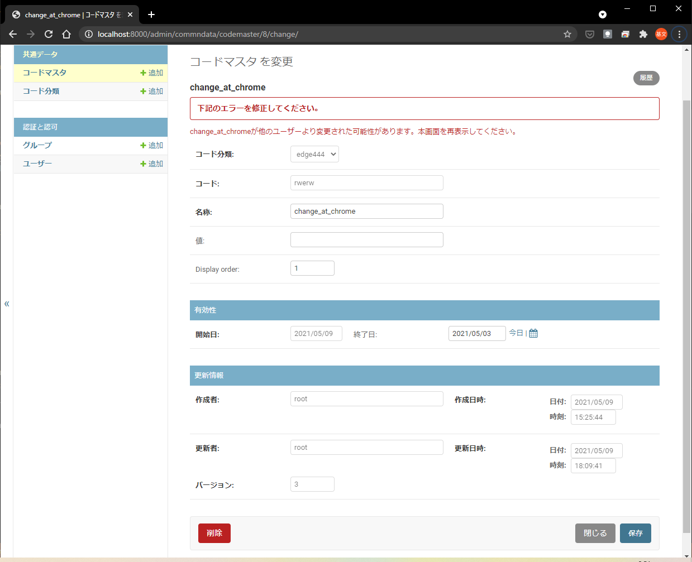

# commndata

Collected some commonly used table columns to BaseTable and TimeLinedTable.

## BaseTable
- BaseTable's fields:
  - version
  - created_at
  - creator
  - updated_at
  - updater
- BaseTable's optimistic lock
  - for update, we execute an optimistic concurrency check using version field.

## TimeLinedTable
- TimeLinedTable's fields:
  - start_date
  - end_date
- TimeLinedTable's history management
  - for the same start_date, we update the record
  - for a newer start_date, we create a new record and set the old record's end_date as the new record's start_date - 1
  - for a record, which have a newer record, it became not editable.

## Screenshots

## Installation and configuration
- installation
  <pre>
  >pip install commndata
  </pre>
- configuration(settings.py)
  <pre>
  INSTALLED_APPS = (
    ...
    'commndata',
  )
  </pre>

## Example app
<pre>
>cd tests
>python manage.py migrate
>python manage.py createsuperuser
>python manage.py rnserver
</pre>