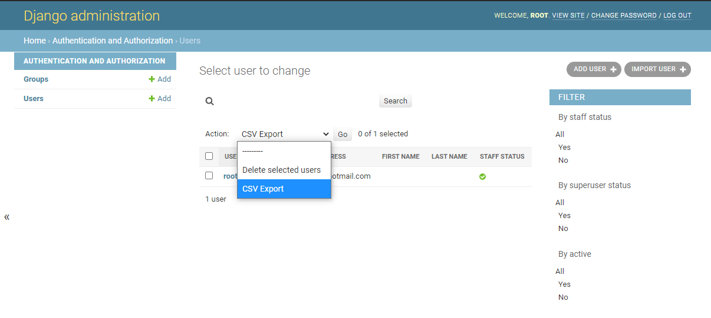
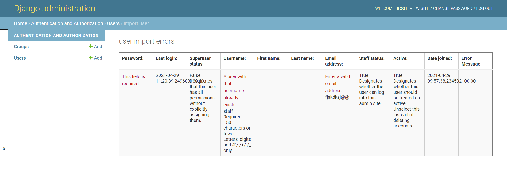

# 共通データ

テーブル定義でよく使うカラムをBaseTableとTimeLinedTableにまとめた。

## BaseTable
- BaseTableのカラム:
  - version（バージョン）
  - created_at（作成日時）
  - creator（作成者）
  - updated_at（更新日時）
  - updater（更新者）
- BaseTableの楽観的排他
  - 単一テーブルを画面表示して更新操作を行うとき、自動的に楽観的排他チェックが行われる
  - 楽観的排他はversionカラムの変更有無によって判定される

## TimeLinedTable
- TimeLinedTableのカラム:
  - start_date（適用開始日）
  - end_date（適用終了日）
- TimeLinedTableの履歴管理
  - 新規作成の場合、適用開始日が既存のすべての適用開始日より新しいときは、新規レコードを作成し、既存の最新レコードの適用終了日を新規適用開始日の前日に更新する
  - 既存適用開始日より古い適用開始日で、新規レコードを作成することはできない。
  - 適用開始日が最新ではないものは、編集不可とする
  - 最新レコードの限り、適用開始日を変更することができる

## 都道府県コード、郵便番号、市区町村コード等
  - 一般的なアプリでよく使うデータを収集してModelかChoiceにまとめていく。

## Screenshots

## インストールと設定
- インストール
  <pre>
  >pip install commndata
  </pre>
- 設定(settings.py)
  <pre>
  INSTALLED_APPS = (
    ...
    'commndata',
  )
  </pre>

## サンプルApp
<pre>
>cd tests
>python manage.py migrate
>python manage.py createsuperuser
>python manage.py rnserver
</pre>